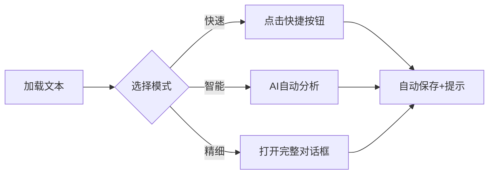

# 🚀 快速上手指南 v4.1

## 核心功能速览

### 1. 基础标注（3步完成）

```
选中文本 → 点击类别 → 自动保存
```

**快捷方式**：
- 生词：黄色底色 + ⭐
- 词组：绿色底色 + 下划线
- 重点：蓝色底色 + 💡
- 疑难：橙色底色 + ❗

### 2. AI智能分析

```
点击"🤖 AI分析" → 自动标注所有语法成分
```

**9种语法标注**：
- 主要主语：黑色加粗
- 从句主语：绿色加粗
- 主要谓语：红色加粗
- 从句谓语：深红加粗
- 宾语/表语：橙色
- 定语 (紫色)：自动加 `( )`
- 状语 [蓝色]：自动加 `[ ]`
- 连词：青色
- 引导词 {粉色}：自动加 `{ }`

### 3. 快速翻译

```
选中文本 → 右键 → AI翻译
```

### 4. 生词本复习

```
右键标注 → 添加到生词本 → 点击📖复习
```

---

## 使用流程

### 第一次使用

1. **加载文本**
   - 左侧粘贴英文 → 点击"保存并打开短文"

2. **配置AI**（可选）
   - 点击右上角"🤖 AI"
   - 输入OpenAI或Claude API密钥
   - 选择模型（推荐gpt-3.5-turbo）

3. **开始标注**
   - 方式A：选中文本 → 点击"生词/重点"等快捷按钮
   - 方式B：点击"🤖 AI分析"全文自动标注

### 日常使用



---

## 快捷操作

### 键盘快捷键
- `Ctrl+Z`: 撤销
- `Ctrl+Y`: 重做
- `Ctrl+1~5`: 快速选颜色
- `↑/↓` 或 `j/k`: 导航标注

### 右键菜单
- 🤖 AI翻译
- ⭐ 添加到生词本
- 🔊 朗读文本
- 📝 快速标注

---

## 实用技巧

### 技巧1：批量相同文本标注
标注一个单词后，右键选择"标注所有相同文本"

### 技巧2：保存标注模板
常用样式 → 点击"💾 存模板" → 下次直接"📋 用模板"

### 技巧3：导出复习
- Markdown：适合打印复习
- Anki CSV：导入记忆卡片
- JSON：备份数据

### 技巧4：实时预览
选中文本后，在对话框中选择颜色/样式会立即看到效果

---

## 问题排查

### Q1: 选中文本后没有弹出对话框？
**A**: 确保在阅读区选择文本，不是在输入框

### Q2: AI分析提示缺少API密钥？
**A**: 点击右上角"🤖 AI" → 输入API密钥 → 保存

### Q3: 标注保存后看不到？
**A**: 检查右侧"我的标注"列表，点击"定位"跳转

### Q4: 朗读功能无效？
**A**: 部分浏览器不支持TTS，推荐使用Chrome/Edge

### Q5: 导出的Anki文件乱码？
**A**: 使用UTF-8编码打开CSV文件

---

## 最佳实践

### 考研阅读标注流程

```
1. 首次通读 → 标注生词（黄色⭐）
2. 精读 → AI语法分析
3. 难句 → 标注为疑难（橙色❗）+ 添加注释
4. 重点 → 标注关键句（蓝色💡）
5. 复习 → 导出Markdown打印
```

### 日常阅读流程

```
1. 加载文章
2. 点击"AI分析"自动标注语法
3. 遇到生词 → 右键AI翻译 → 添加生词本
4. 完成后 → 点击📖复习生词本
```

### 精读分析流程

```
1. 手动标注主语、谓语、宾语
2. 标注定语、状语（自动加符号）
3. 添加注释说明语法结构
4. 导出Markdown查看分析结果
```

---

## 新功能 v4.1

### ✨ 快速标注模式
- 一键保存，无需复杂配置
- 智能默认样式
- 成功提示Toast

### 🎨 UI优化
- 现代化对话框设计
- 语法按钮颜色点指示
- 暗黑模式完美适配

### 🛡️ 错误处理增强
- 清晰的中文提示
- API配置自动验证
- TTS错误详细说明

### 📊 实时预览
- 选择样式立即看效果
- 所见即所得

---

## 数据安全

- ✅ 所有数据保存在浏览器本地
- ✅ 不上传服务器
- ✅ 支持完整备份导出
- ✅ 随时清空数据

**备份建议**：
每周点击"备份"保存JSON文件到电脑

---

## 性能优化

- 支持大文本（万字级别）
- 标注即时保存
- 搜索筛选快速响应
- 暗黑模式节省电量

---

## 使用限制

- AI功能需要网络连接
- API调用需要密钥（自行申请）
- TTS依赖浏览器支持
- 建议使用Chrome/Edge浏览器

---

## 下一步

1. 📖 查看完整文档：[FEATURE_CHECKLIST.md](./FEATURE_CHECKLIST.md)
2. 🤖 AI配置教程：[AI_GRAMMAR_ANNOTATION.md](./AI_GRAMMAR_ANNOTATION.md)
3. 🎨 颜色参考：[GRAMMAR_COLORS_REFERENCE.md](./GRAMMAR_COLORS_REFERENCE.md)
4. 📊 优化方案：[OPTIMIZATION_PLAN.md](./OPTIMIZATION_PLAN.md)

---

**快速开始**：加载文本 → 点击"AI分析" → 开始学习！

**版本**: v4.1
**更新**: 2025-10-02
**核心理念**: 简单、直观、高效
